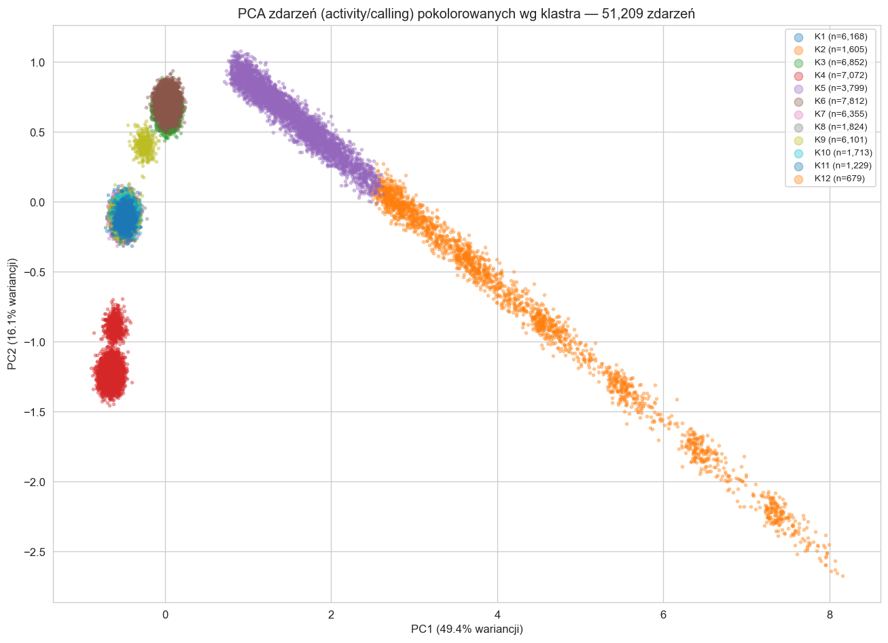
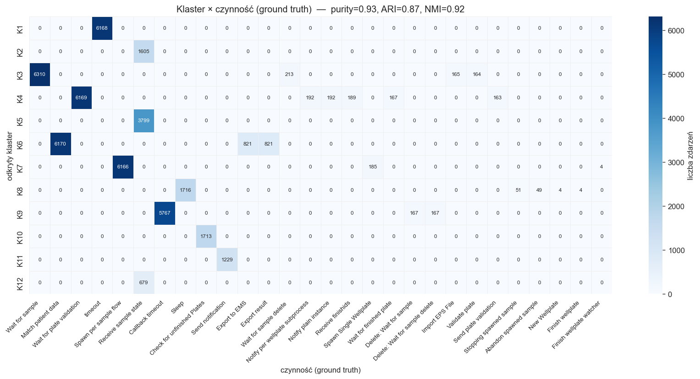
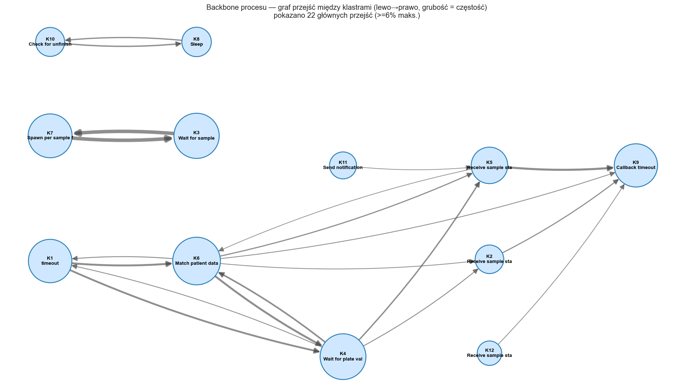

# Milestone 2: Klasteryzacja danych

- **Autorzy:** Mateusz Świątek, Maciej Mężyk, Patryk Skowron
- **Zbiór:** PCR Lab Data
- **Źródło:** [Zenodo #11617408](https://zenodo.org/records/11617408)
- **Notebook:** [`notebooks/02_m2_event_clustering.ipynb`](../notebooks/02_m2_event_clustering.ipynb)

---

## 1. Cel

Klasteryzujemy dane niskopoziomowe logu, żeby odtworzyć kroki procesu i wyjaśnić outliery. Jednostką analizy jest pojedyncze zdarzenie silnika, nie endpoint. Cechami są surowy payload `data` każdego zdarzenia oraz pozycja próbki na płytce, czyli najniższy dostępny poziom danych. Celem jest odkrycie procesu z samych klastrów i wyjaśnienie outlierów.

Świadomie nie używamy:

- endpointów (adresów serwisów), bo nie opisują samej czynności,
- wyniku PCR (`result`/`ct`/`state`), bo to ground truth, czyli rezultat procesu, a nie sposób jego działania,
- agregatów przypadku (`duration_min`) ani `timestamp` jako cech; czas służy wyłącznie do uporządkowania sekwencji,
- etykiety czynności `activity`; używamy jej tylko jako ground truth do walidacji 1:1.

### Uwaga o danych

Zbiór to log procesowy CPEE, nie telemetria, i nie zawiera fizycznych czujników (nagłówek deklaruje ontologie W3C SSN/SOSA, ale żadne zdarzenie ich nie używa). Najniższym realnym poziomem danych jest payload pojedynczego wywołania w silniku oraz pozycja próbki na płytce 96-dołkowej, i to właśnie klasteryzujemy.

Przegląd całego payloadu pokazuje, że poza sygnaturą argumentów i pozycją na płytce log nie zawiera innych klastrowalnych zmiennych niskopoziomowych. Pozostałe pola to identyfikatory (`pid`, `sampleid`, `plateid`, bez znaczenia dla podobieństwa), pole puste albo dane wykluczone powyżej (endpointy, ground truth, czas agregatu). Dobór cech wykorzystuje więc wszystkie dostępne zmienne niskopoziomowe.

---

## 2. Dane wejściowe: typy i statystyki

Źródło: `data/processed/pcr_events_rich.parquet`

| Metryka | Wartość |
|---|---:|
| Wszystkich zdarzeń silnika | 317 905 |
| Przypadków | 6 339 |
| Zdarzenia `activity/calling` (jednostka klasteryzacji) | 51 209 |
| Czynności (ground truth) | 28 |

Mikro-stany silnika (`cpee_lifecycle`): `activity/done` (82 890), `dataelements/change` (66 363), `activity/receiving` (58 330), `activity/calling` (51 209), `state/change`, `gateway/join`, `task/instantiation` i inne. Payload biznesowy niosą zdarzenia `activity/calling` (moment wywołania czynności z argumentami) i tylko one są jednostką klasteryzacji. Mikro-stany `receiving`/`done` nie niosą payloadu, a `dataelements/change`/`state/change` zawierają wynik PCR (ground truth), więc je pomijamy.

Przykłady danych wejściowych do klasteryzacji (payload + pozycja):

| activity (GT) | data_vars (payload) | position | pid |
|---|---|---:|---:|
| timeout | `duration` | — | — |
| Match patient data | `pid,sampleid` | — | 6 |
| Wait for plate validation | `id,ttl,delete` | — | — |
| Receive sample state | `pid,sampleid,plateid,position` | 50 | 13 |
| Callback timeout | `stop` | — | — |

Każda czynność ma charakterystyczną sygnaturę argumentów. To jest sygnał niskopoziomowy, na którym pracujemy.

---

## 3. Macierz cech

Cechy zdarzenia to struktura wywołania (które argumenty są przekazywane, kodowanie one-hot, w tym argumenty czasowe payloadu `duration`/`ttl`) oraz pozycja na płytce (skalowana wartość i flaga obecności). Z payloadu wykluczamy:

- zmienne endpointowe i konfiguracyjne (`timeout`-URL, `subprocess`, `receive`, `send`, `correlator`, `notify`, `url`, `endpoints`, `behavior`, `customization`, `init`),
- ground truth (`result`, `state`, `ct`),
- pola modelu i bookkeeping (`info`, `creator`, `author`, `modeltype` i podobne).

Wynik: 51 209 zdarzeń × 17 cech: `attributes, createdids, delete, duration, finishids, id, level, message, pid, plateid, position, sampleid, stop, ttl, value, position_scaled, has_position`.

---

## 4. Redukcja wymiarowości i klasteryzacja

Liczbę klastrów dobrano metodą sylwetki (KMeans, `k = 3..12`):

| k | 3 | 5 | 7 | 9 | 10 | 11 | **12** |
|---|---:|---:|---:|---:|---:|---:|---:|
| silhouette | 0.37 | 0.52 | 0.69 | 0.86 | 0.86 | 0.88 | **0.92** |

Wybrano k = 12 (silhouette 0.917). Tak wysoka wartość bierze się stąd, że sygnatury argumentów są dyskretne i dobrze rozdzielone.

### 4.1 PCA zdarzeń

Rzutujemy 51 209 zdarzeń, kolor oznacza odkryty klaster. Grupy są wyraźnie rozdzielone. Ukośna smuga (klastry K2/K5/K12) to czynność *Receive sample state* rozłożona według pozycji na płytce: cecha przestrzenna tworzy ciągły gradient.

---

## 5. Charakterystyka i nazwanie klastrów

| Klaster | n | Sygnatura argumentów | Poz. (mediana) | Dominująca czynność (GT) | Czystość |
|---|---:|---|---:|---|---:|
| K1 | 6 168 | `duration` | — | timeout | 100% |
| K2 | 1 605 | `pid,plateid,position,sampleid` | 35 | Receive sample state | 100% |
| K3 | 6 852 | `pid,plateid` | — | Wait for sample | 92% |
| K4 | 7 072 | `delete,id,ttl` | — | Wait for plate validation | 87% |
| K5 | 3 799 | `pid,plateid,position,sampleid` | 9 | Receive sample state | 100% |
| K6 | 7 812 | `pid,sampleid` | — | Match patient data | 79% |
| K7 | 6 355 | `attributes` | — | Spawn per sample flow | 97% |
| K8 | 1 824 | `∅` (bez payloadu) | — | Sleep | 94% |
| K9 | 6 101 | `stop` | — | Callback timeout | 95% |
| K10 | 1 713 | `createdids,finishids` | — | Check for unfinished Plates | 100% |
| K11 | 1 229 | `level,message` | — | Send notification | 100% |
| K12 | 679 | `pid,plateid,position,sampleid` | 73 | Receive sample state | 100% |

Obserwacje:

- Każdy klaster ma jedną sygnaturę argumentów odpowiadającą realnej czynności.
- K1 (`duration` = 25 200 s) to czynność `timeout`.
- K8 (`∅`, bez payloadu) to *Sleep*. Jako jedyna czynność nie ma żadnych argumentów biznesowych, więc pozostaje nierozróżnialna od pustego zdarzenia. To granica informacyjna logu, a nie błąd klasteryzacji.
- K2, K5 i K12 to ta sama czynność *Receive sample state*, rozdzielona według pozycji na płytce (mediana 9 / 35 / 73). Klasteryzacja wydobyła z niej strukturę przestrzenną próbek.

---

## 6. Porównanie 1:1 z ground truth

Sprawdzamy, czy klastry odkryte wyłącznie z payloadu odtwarzają realne kroki procesu. Etykieta `activity` nie była cechą.

| Metryka | Wartość |
|---|---:|
| Purity | **0.927** |
| Adjusted Rand Index (ARI) | **0.869** |
| Normalized Mutual Information (NMI) | **0.917** |

Macierz pomyłek ma strukturę blokową: każdy klaster koncentruje się na jednej czynności. Payload wystarcza, żeby bez nadzoru odtworzyć kroki procesu.

---

## 7. Sekwencje klastrów w czasie i graf przejść

Dla każdego przypadku zdarzenia uporządkowano po czasie i otrzymano sekwencję klastrów (czas służy tylko do uporządkowania). Najczęstsze warianty:

| Liczność | Sekwencja klastrów |
|---:|---|
| 1 124 | K1 → K6 → K4 → K5 → K9 |
| 907 | K1 → K4 → K6 → K5 → K9 |
| 465 | K1 → K6 → K4 → K2 → K9 |
| 351 | K1 → K4 → K6 → K2 → K9 |

Po nazwach czynności jest to: timeout → Match patient data → Wait for plate validation → Receive sample state → Callback timeout. To odtworzony z danych niskopoziomowych główny przepływ procesu próbki.

---

## 8. Outliery z perspektywy odkrytego procesu

Outlier definiujemy procesowo: jako przypadek, którego sekwencja klastrów zawiera rzadkie przejścia (spoza głównego grafu), a nie po prostu długi czas trwania.

- Przypadków z rzadkimi przejściami: 57 (0.9%).
- Najrzadsze przejścia (np. `K3 → K1`, `K1 → K3`, `K7 → K7`, pętle) wskazują nietypowe kolejności kroków.
- Dla odniesienia (nie jako kryterium): mediana `duration_min` dla outlierów procesowych wynosi 408 min wobec 175 min dla wszystkich przypadków. Anomalie strukturalne pokrywają się więc z dłuższym czasem.

Outlier jest tu wyjaśniony odkrytym procesem (nietypowa ścieżka klastrów), a nie zdefiniowany z góry przez `duration`.

---

## 9. Wnioski

1. Dane niskopoziomowe niosą sensowny sygnał. Surowy payload wywołań CPEE i pozycja na płytce pozwalają odtworzyć kroki procesu bez użycia etykiet (Purity 0.93, ARI 0.87, NMI 0.92).
2. Klastry odpowiadają czynnościom procesu. 12 klastrów pokrywa się z realnymi czynnościami, a sygnatura argumentów jednoznacznie identyfikuje czynność.
3. *Receive sample state* dzieli się według pozycji na płytce (K2/K5/K12). Tej struktury nie widać na poziomie endpointów.
4. Jedyna czynność bez payloadu, *Sleep*, tworzy pusty klaster K8. To granica danych w logu.
5. Sekwencje klastrów odtwarzają główny przepływ procesu, a rzadkie przejścia wskazują outliery procesowe.
6. Zbiór nie zawiera fizycznej telemetrii, więc przyjęliśmy najniższy dostępny poziom danych, czyli payload zdarzenia.
