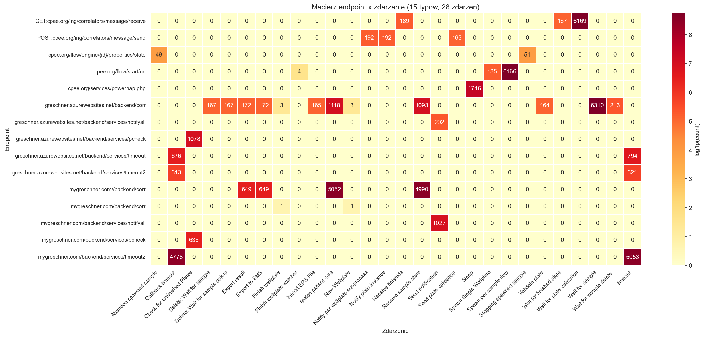
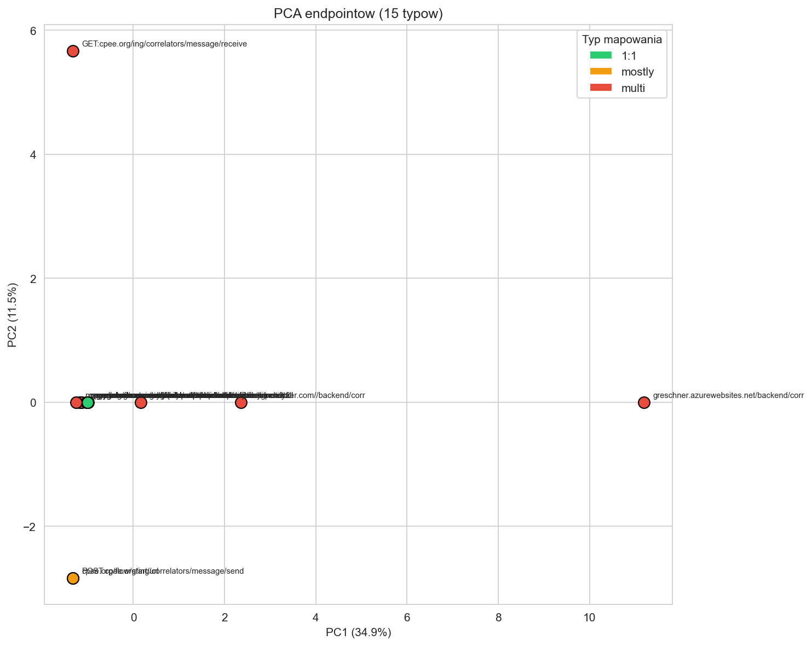
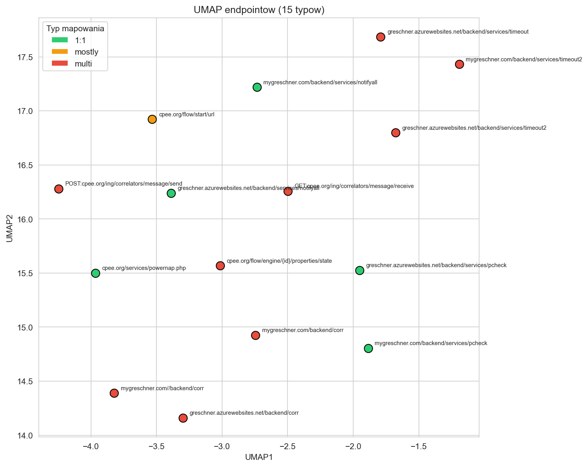
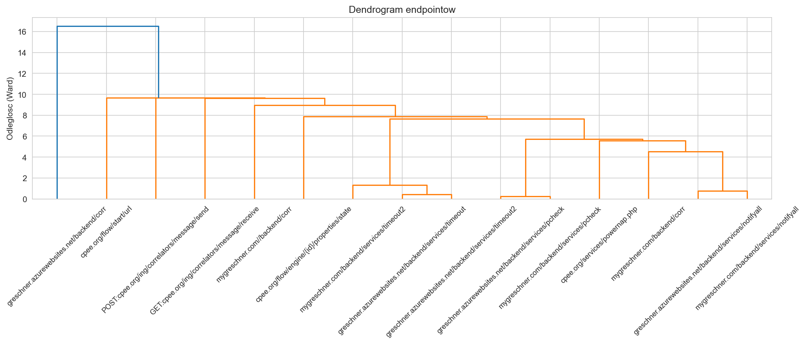

# Milestone 2

- **Autorzy:** Mateusz Świątek, Maciej Mężyk, Patryk Skowron
- **Zbiór:** PCR Lab Data
- **Źródło:** [Zenodo #11617408](https://zenodo.org/records/11617408)
- **Notebook:** [`notebooks/02_m2_endpoint_clustering.ipynb`](../notebooks/02_m2_endpoint_clustering.ipynb)

---

## 1. Cel i zakres

Celem Milestone 2 jest analiza endpointów (adresów serwisów) w logu zdarzeń:

1. Zmapować endpointy na zdarzenia — zbudować macierz rozkładów i określić czy mapowanie jest 1:1 czy wiele-do-wielu.
2. Sprawdzić czy niektóre endpointy łączą się w jedno zdarzenie (np. ten sam serwis na dwóch domenach).
3. Normalizacja → redukcja wymiarowości (PCA/UMAP) → klasteryzacja → walidacja klastrów względem 8 docelowych zdarzeń.

Pipeline: **endpointy → normalizacja → PCA/UMAP → klasteryzacja hierarchiczna → walidacja.**

---

## 2. Dane i przygotowanie

- Dane wejściowe: `data/processed/pcr_events_biz.parquet` i `data/processed/pcr_cases.parquet`.
- Do mapowania endpointów bierzemy wyłącznie zdarzenia typu `start` (bez dublowania z `complete`).

| Metryka | Wartość |
|---|---|
| Zdarzenia `start` z endpointem | 51 209 |
| Surowe endpointy (unikalne URL) | 63 |
| Typy zdarzeń | 28 |

### Normalizacja per-instance CPEE

49 z 63 surowych endpointów to adresy instancji silnika CPEE (`cpee.org/flow/engine/{id}/properties/state/`), różniące się jedynie identyfikatorem instancji. Normalizujemy je do jednego typu. Wynik: **15 logicznych typów endpointów** × 28 zdarzeń.

### 8 docelowych zdarzeń

Na potrzeby walidacji wyróżniamy 8 zdarzeń zdefiniowanych w zadaniu:

| Zdarzenie |
|---|
| Callback timeout |
| Export result |
| Export to EMS |
| Match patient data |
| Receive sample state |
| Send notification |
| Wait for plate validation |
| timeout |

---

## 3. Mapowanie endpoint → zdarzenie

### 3.1 Metoda

1. Budujemy macierz `endpoint × zdarzenie` (liczność wystąpień `start`).
2. Dla każdego endpointa wyznaczamy dominujące zdarzenie i jego udział procentowy.
3. Klasyfikujemy mapowanie:
   - **1:1** — endpoint występuje tylko w jednym typie zdarzenia.
   - **Mostly** — dominujący udział ≥ 95%, ale endpoint pojawia się w kilku zdarzeniach.
   - **Multi** — brak dominacji, endpoint wspólny dla wielu zdarzeń.

### 3.2 Wyniki

| Typ mapowania | Liczba endpointów |
|---|---:|
| 1:1 | 5 |
| Mostly | 1 |
| Multi | 9 |

Mapowanie jest **wiele-do-wielu**: jeden endpoint (np. `*/backend/corr`) obsługuje do 12 zdarzeń, a jedno zdarzenie (np. `timeout`) korzysta z 3 endpointów.

**Endpointy 1:1:**

| Endpoint | Zdarzenie |
|---|---|
| `cpee.org/services/powernap.php` | Sleep |
| `greschner.azurewebsites.net/.../notifyall` | Send notification |
| `greschner.azurewebsites.net/.../pcheck` | Check for unfinished Plates |
| `mygreschner.com/.../notifyall` | Send notification |
| `mygreschner.com/.../pcheck` | Check for unfinished Plates |

**Endpoint mostly (1):**

| Endpoint | Zdarzeń | Dominujące zdarzenie | Udział |
|---|---:|---|---:|
| `cpee.org/flow/start/url` | 3 | Spawn per sample flow | 49% |

Pozostałe zdarzenia: Finish wellplate watcher, Spawn Single Wellplate.

**Endpointy multi (9)** — najistotniejsze:

| Endpoint | Zdarzeń | Dominujące zdarzenie | Udział |
|---|---:|---|---:|
| `greschner.azurewebsites.net/backend/corr` | 12 | Match patient data | 32% |
| `mygreschner.com//backend/corr` | 4 | Match patient data | 46% |
| `*/services/timeout*` (3 endpointy) | 2 | timeout | 73–88% |
| `GET:cpee.org/.../message/receive` | 3 | Wait for plate validation | 47% |
| `POST:cpee.org/.../message/send` | 3 | Notify per wellplate subprocess | 35% |

### 3.3 Odwrotne mapowanie: zdarzenie → endpointy

Sprawdzamy czy niektóre endpointy łączą się w jedno zdarzenie.

| Zdarzenie | Endpointów | Wniosek |
|---|---:|---|
| timeout | 3 | Ten sam serwis timeout na 2 domenach + 2 wersjach |
| Callback timeout | 3 | j.w. |
| Match patient data | 2 | `*/backend/corr` na 2 domenach |
| Receive sample state | 2 | j.w. |
| Export result | 2 | j.w. |
| Export to EMS | 2 | j.w. |
| Send notification | 2 | `*/notifyall` na 2 domenach |
| Check for unfinished Plates | 2 | `*/pcheck` na 2 domenach |
| Finish wellplate | 2 | `*/backend/corr` na 2 domenach |
| New Wellplate | 2 | j.w. |
| Wait for plate validation | 1 | Jedyny endpoint |
| Import EPS File | 1 | Jedyny endpoint |
| Validate plate | 1 | Jedyny endpoint |
| Remaining (15 zdarzeń) | 1 | Po jednym endpoincie |

**Wniosek:** Większość zdarzeń jest obsługiwana przez ten sam serwis zduplikowany na dwóch domenach (`mygreschner.com` i `greschner.azurewebsites.net`). To nie są odrębne serwisy — to ta sama logika na dwóch hostach.

### 3.4 Heatmapa macierzy endpoint × zdarzenie

Heatmapa potwierdza widoczny podział: endpointy `*/backend/corr` obsługują szerokie spektrum zdarzeń, natomiast serwisy timeout, notyfikacji i sprawdzania płytek są wyspecjalizowane.

---

## 4. Redukcja wymiarowości

Normalizacja: `log1p` + `StandardScaler` na macierzy 15×28.

### 4.1 PCA

Kolory odpowiadają typowi mapowania: zielony = 1:1, pomarańczowy = mostly, czerwony = multi.

| Metryka | Wartość |
|---|---|
| Wariancja PC1 | 34.9% |
| Wariancja PC2 | 11.5% |
| Suma (2 komponenty) | 46.4% |

`greschner.azurewebsites.net/backend/corr` jest wyraźnym outlierem na PC1 — obsługuje 12 zdarzeń, co daje mu unikalny profil. `GET:cpee.org/.../message/receive` wyróżnia się na PC2 jako najczęściej wywoływany korelator (12 957 wywołań).

Endpointy 1:1 (zielone) grupują się blisko siebie — mają proste, jednozdarzeniowe profile. Endpointy multi (czerwone) rozpraszają się szeroko, odzwierciedlając ich zróżnicowane spektra zdarzeń.

### 4.2 UMAP

UMAP daje lepszą separację niż PCA. Widoczne grupy:

- **Serwisy timeout** (3 endpointy): obsługują `timeout` i `Callback timeout`.
- **Endpointy `*/backend/corr`**: obie domeny blisko siebie — podobne profile zdarzeń.
- **Serwisy platformy CPEE**: `flow/start`, `engine/{id}`, `powernap`, korelatory.
- **Serwisy notyfikacji i sprawdzania płytek**: `*/notifyall`, `*/pcheck`.

---

## 5. Klasteryzacja i walidacja

### 5.1 Dendrogram

Klasteryzacja hierarchiczna (Ward). Dendrogram potwierdza:

- **Najwcześniejsze łączenia** (odległość < 2): pary tego samego serwisu na dwóch domenach — `*/notifyall` (0.7), `*/pcheck` (0.7), `*/timeout` + `*/timeout2` (1.3).
- **Środkowy poziom** (4–8): grupy funkcjonalne — timeout serwisy, korelatory CPEE, backend `corr`.
- **Najpóźniejsze łączenia** (>10): `greschner.../backend/corr` i `cpee.org/flow/start/url` dołączają ostatnie — mają unikalne profile zdarzeń.

### 5.2 Walidacja klastrów

Testujemy trzy poziomy cięcia dendrogramu: k=3, k=5, k=8.

| k | Silhouette | Opis |
|---|---:|---|
| 3 | 0.250 | Trzy duże grupy — słaba separacja |
| 5 | 0.273 | Najlepsza wartość — wyspecjalizowane endpointy wydzielone |
| 8 | 0.230 | Zbyt drobne podziały przy n=15 |

Niskie wartości silhouette (0.23–0.27) wynikają z małego n=15. Struktura jest jednak czytelna w dendrogramie.

**Klastry przy k=5 (najlepszy silhouette):**

| Klaster | Endpointy | Zdarzenia (wybrane) |
|---|---:|---|
| 1 | 11 | timeout, Callback timeout, Match patient data, Export result, Export to EMS, Receive sample state, Send notification, Check for unfinished Plates, Sleep i inne |
| 2 | 1 (`GET:cpee.org/.../receive`) | Wait for plate validation, Receive finishids, Wait for finished plate |
| 3 | 1 (`POST:cpee.org/.../send`) | Notify per wellplate subprocess, Notify plain instance, Send plate validation |
| 4 | 1 (`cpee.org/flow/start/url`) | Spawn per sample flow, Spawn Single Wellplate, Finish wellplate watcher |
| 5 | 1 (`greschner.../backend/corr`) | Match patient data, Export result, Export to EMS, Receive sample state, Import EPS File, Validate plate i inne (12 zdarzeń) |

Klastry 2–5 to singletony — endpointy o unikalnych profilach. Klaster 1 gromadzi 11 endpointów o prostszych lub nakładających się profilach.

**Klastry przy k=8 (granulacja per serwis):**

| Klaster | Endpointy | Dominujące zdarzenia |
|---|---:|---|
| 1 | 3 (timeout×3) | timeout, Callback timeout |
| 2 | 6 (notifyall, pcheck, powernap, mygreschner/corr) | Send notification, Check for unfinished Plates, Sleep, Export result, Match patient data |
| 3 | 1 (`engine/{id}`) | Abandon spawned sample, Stopping spawned sample |
| 4 | 1 (`mygreschner.com//backend/corr`) | Match patient data, Export result, Export to EMS, Receive sample state |
| 5 | 1 (`GET:cpee.org/.../receive`) | Wait for plate validation, Receive finishids |
| 6 | 1 (`POST:cpee.org/.../send`) | Notify per wellplate subprocess, Notify plain instance |
| 7 | 1 (`cpee.org/flow/start/url`) | Spawn per sample flow, Spawn Single Wellplate |
| 8 | 1 (`greschner.../backend/corr`) | 12 zdarzeń (Match patient data, Import EPS File, Validate plate, ...) |

Klastry 4 i 8 to oba `*/backend/corr` — obsługują wiele tych samych zdarzeń, ale nie klastrują się razem, ponieważ `greschner.../backend/corr` obsługuje dodatkowo 8 zdarzeń, których `mygreschner.com//backend/corr` nie ma.

---

## 6. Wnioski

1. **Mapowanie jest wiele-do-wielu.** 9 z 15 endpointów obsługuje wiele zdarzeń; jednocześnie wiele zdarzeń korzysta z więcej niż jednego endpointa. Nie istnieje proste mapowanie 1:1 między endpointami a zdarzeniami.

2. **Duplikacja domen.** Serwisy `mygreschner.com` i `greschner.azurewebsites.net` to te same usługi na dwóch hostach. Dendrogram łączy je na najniższym poziomie (odległość < 2). Po logicznej konsolidacji domen mamy efektywnie 4–5 unikalnych serwisów, nie 8.

3. **Centralny komponent: `*/backend/corr`.** Ten endpoint obsługuje 12 zdarzeń i jest outlierem zarówno w PCA, jak i w klasteryzacji. To hub systemu CPEE łączący procesy różnych typów.

4. **Endpointy = serwisy wielokrotnego użytku.** Klasteryzacja grupuje endpointy wg funkcji serwisowej (timeout, notyfikacje, korelacja), a nie wg procesu. Endpointy nie są dedykowanymi modułami per zdarzenie — to współdzielone mikroserwisy.

5. **Ograniczenia analizy.** n=15 punktów to minimum dla PCA/UMAP/klasteryzacji. Silhouette (max 0.273) jest niski, ale dendrogram i UMAP dają czytelną strukturę. Przy większej liczbie endpointów (np. w systemie produkcyjnym z setkami serwisów) pipeline byłby bardziej informatywny.
