# Milestone 3

- **Autorzy:** Mateusz Świątek, Maciej Mężyk, Patryk Skowron
- **Zbiór:** PCR Lab Data
- **Źródło:** [Zenodo #11617408](https://zenodo.org/records/11617408)
- **Notebook:** [`notebooks/03_m3_process_discovery.ipynb`](../notebooks/03_m3_process_discovery.ipynb)

---

## 1. Cel i zakres

Celem Milestone 3 jest odkrycie i analiza modelu procesu na podstawie logu zdarzeń PCR Lab:

1. Wygenerowanie DFG (Directly-Follows Graph) — częstościowego i wydajnościowego.
2. Porównanie czterech algorytmów odkrywania modelu: Alpha Miner, Inductive Miner (IM), IMf, Heuristic Miner.
3. Analiza zgodności modeli z logiem (conformance checking).
4. Stworzenie modelu BPMN i propozycje usprawnień.
5. Odkrycie reguł decyzyjnych (drzewa decyzyjne).
6. Analiza zasobów — endpointy jako proxy mikrousług.
7. Identyfikacja wąskich gardeł i symulacja Monte Carlo.
8. Interaktywny dashboard HTML.

Pipeline: **EventLog → DFG → odkrywanie modelu (×4) → conformance → BPMN → reguły → zasoby → symulacja → dashboard.**

---

## 2. Dane i przygotowanie

- Dane wejściowe: `data/processed/pcr_events_biz.parquet` i `data/processed/pcr_cases.parquet`.
- Do odkrywania modelu używamy **wyłącznie zdarzeń `complete`** — jeden punkt w czasie na aktywność, zgodnie ze standardem process mining.
- Do analizy zasobów używamy zdarzeń `start` (moment wywołania endpointu).

| Metryka | Wartość |
|---|---|
| Przypadki (process_type = sample) | 6 166 |
| Zdarzenia `complete` | 32 356 |
| Zdarzenia `start` | 51 209 |
| Unikalne aktywności | 8 |
| Warianty procesu | 47 |

### Konwersja do pm4py EventLog

DataFrame przetworzono przez `pm4py.format_dataframe()` z mapowaniem:
- `case_id = instance_uuid`, `activity_key = activity`, `timestamp_key = timestamp`

Wynikowy EventLog: **6 162 traces** (4 przypadki bez zdarzeń `complete` pominięte).

---

## 3. DFG — Directly-Follows Graph

### 3.1 Frequency DFG

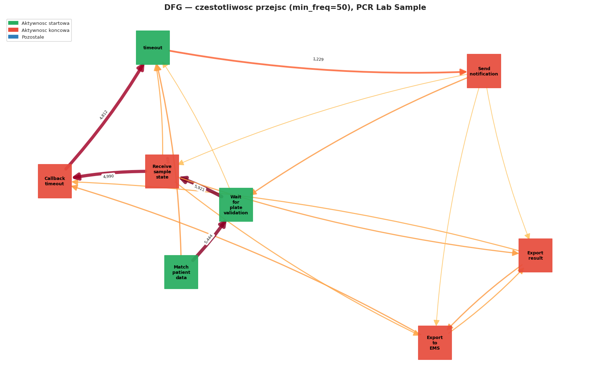

Graf posiada **28 łuków**. Najczęstsze bezpośrednie następstwa:

| Aktywność źródłowa | Aktywność docelowa | Liczba |
|---|---|---:|
| Wait for plate validation | Receive sample state | 5 921 |
| Match patient data | Wait for plate validation | 5 444 |
| Receive sample state | Callback timeout | 4 990 |
| Callback timeout | timeout | 4 812 |
| timeout | Send notification | 1 229 |
| Match patient data | timeout | 498 |

Dominuje **ścieżka główna**: Match patient data → Wait for plate validation → Receive sample state → Callback timeout → timeout (65% przypadków). Łuk Match patient data → timeout (n=498) to alternatywna ścieżka pomijająca walidację płytki — prawdopodobnie próbki nieprzypisane do żadnej płytki lub przetwarzane w trybie awaryjnym.

### 3.2 Performance DFG

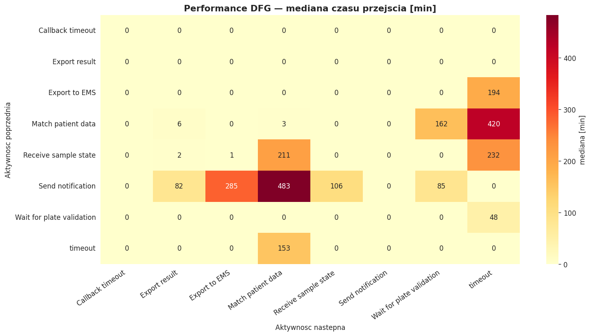

Heatmapa pokazuje czas **complete(A) → complete(B)** w minutach — czas od zakończenia aktywności A do zakończenia aktywności B w tym samym przypadku.

> **Ważna uwaga o strukturze procesu:** Analiza logów ujawniła, że aktywności `timeout`, `Match patient data` i `Wait for plate validation` **startują równocześnie** (CPEE odpala je równolegle w ramach jednego przypadku). Przykładowy przypadek: wszystkie trzy aktywnościowe zdarzenia `start` mają timestamp `14:17:41`, `Match patient data` kończy się po ~6 sekundach, a `Wait for plate validation` po ~165 minutach. Oznacza to, że wartość 162 min na krawędzi Match patient data → Wait for plate validation to **nie jest czas oczekiwania między aktywnościami** — to service time aktywności `Wait for plate validation` (czas procesowania PCR), który zaczął się równolegle.

| Przejście | Mediana [min] | n | Interpretacja |
|---|---:|---:|---|
| Match patient data → timeout (alt.) | 420 | 498 | Service time timeout na ścieżce alternatywnej |
| Receive sample state → timeout | 232 | 292 | Ścieżka alternatywna overnight |
| Match patient data → Wait for plate validation | **162** | **5 444** | ≈ service time WFPV (165 min) — PCR processing |
| Wait for plate validation → Receive sample state | ~0 | 5 921 | Sekwencyjne, natychmiastowe |

Kluczowy wniosek: **bottleneck to fizyczny czas procesowania PCR (~165 min)**, a nie czas oczekiwania między aktywnościami. System już korzysta z równoległości — wszystkie kroki inicjalizacji startują jednocześnie. Jedyna droga optymalizacji to zmniejszenie rozmiaru partii płytek (mniejsza partia = krótszy czas do zakończenia). 

---

## 4. Odkrywanie modelu procesu

### 4.1 Alpha Miner (kontrprzykład)

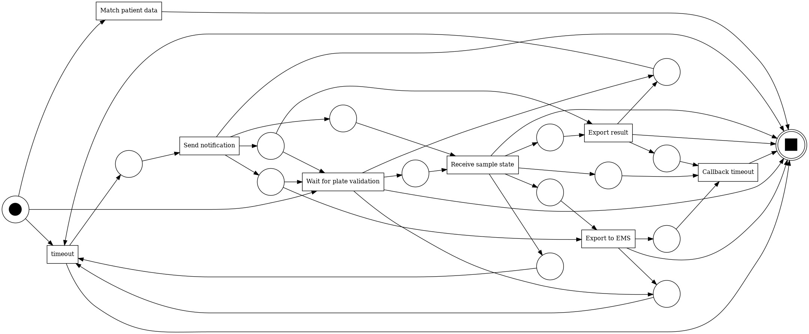

| Właściwość | Wartość |
|---|---|
| Miejsca | 15 |
| Przejścia | 8 |
| Łuki | 41 |

Alpha Miner generuje uproszczoną sieć z 8 widzialnymi przejściami odpowiadającymi 8 aktywno­ściom. Model jest **zbyt prosty**: nie radzi sobie z pętlami (timeout powtarza się w procesie), nie modeluje prawidłowo skip'ów i alternatywnych ścieżek. Wynik conformance (fitness=0.51) potwierdza, że model nie opisuje rzeczywistego zachowania systemu.

> **Dlaczego Alpha Miner nie nadaje się do danych rzeczywistych?**
> Algorytm zakłada acykliczny, skończony język. Pętle i zachowanie niedeterministyczne powodują brakujące miejsca w sieci Petriego (sieć nie jest sound), co uniemożliwia prawidłowe replay śladów.

### 4.2 Inductive Miner (IM)

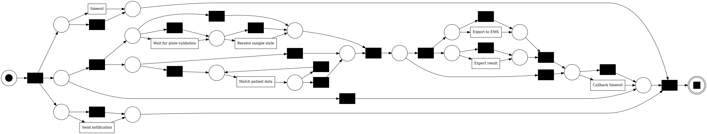

| Właściwość | Wartość |
|---|---|
| Miejsca | 21 |
| Przejścia | 28 |
| Łuki | 64 |

IM rekurencyjnie dzieli log na podlogi i buduje **gwarancyjnie sound** model (każdy ślad logu może być odtworzony na modelu). Wynikowa sieć ma 28 przejść — wiele z nich to przejścia τ (ciche), modelujące pomijalne kroki. Fitness = 1.000 (idealna), ale bardzo niska precision (0.41) oznacza, że model jest zbyt ogólny — pozwala na wiele zachowań, których nie ma w logu.

### 4.3 Inductive Miner Infrequent (IMf, noise_threshold = 0.2)

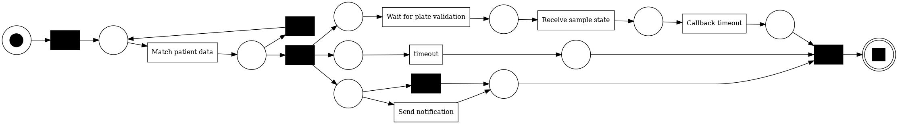

| Właściwość | Wartość |
|---|---|
| Miejsca | 12 |
| Przejścia | 11 |
| Łuki | 26 |

IMf najpierw filtruje rzadkie zachowania (poniżej 20% częstości), a następnie stosuje algorytm Inductive Miner na oczyszczonym logu. Wynikowy model jest **znacznie prostszy**: 11 przejść wobec 28 w IM. Fitness spada do 0.96 (4.1% śladów nie przechodzi), ale precision wzrasta do 0.70. F1 = 0.806 — najlepszy wynik po HM.

### 4.4 Heuristic Miner (dep_threshold = 0.5)

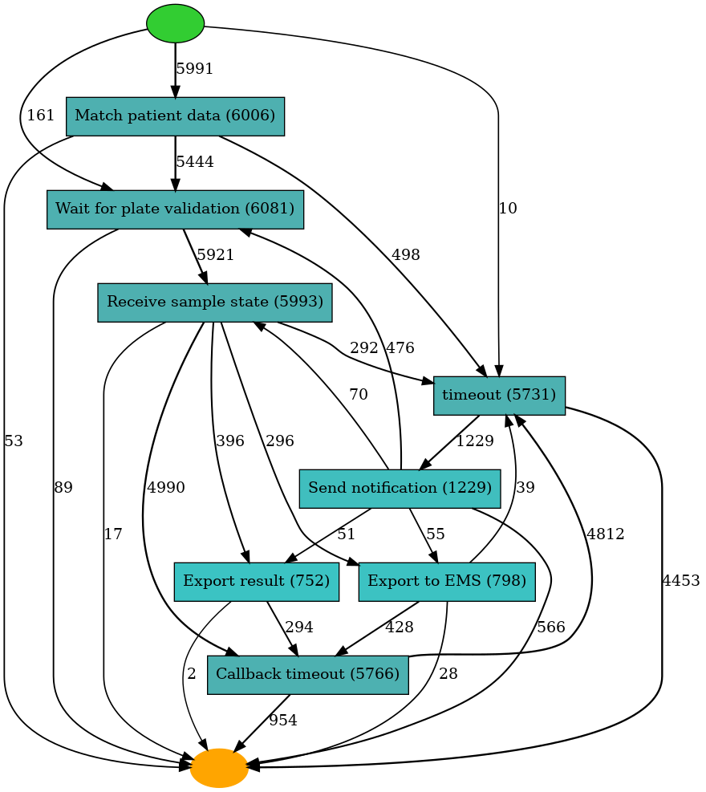
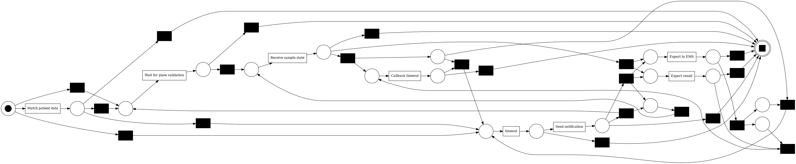

| Właściwość | Wartość |
|---|---|
| Miejsca | 20 |
| Przejścia | 30 |
| Łuki | 69 |

Heuristic Miner buduje model na podstawie DFG z progami zależności (`dependency_threshold = 0.5`: łuk A→B uwzględniany gdy `(A→B − B→A) / (A→B + B→A + 1) ≥ 0.5`). Wynik: **najwyższy F1 = 0.967** (fitness=0.975, precision=0.959). Model wiernie odwzorowuje obserwowane zachowanie, jednocześnie nie będąc zbyt restrykcyjny.

---

## 5. Analiza zgodności (Conformance Checking)

Conformance checking przeprowadzono metodą **token-based replay** (TBR): dla każdego śladu logu symulujemy wykonanie na sieci Petriego i zliczamy brakujące/nadmiarowe tokeny.

### 5.1 Tabela porównawcza

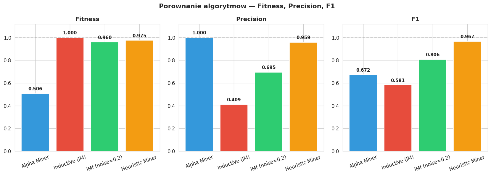

| Algorytm | Fitness | % pasujących tras | Precision | F1 | Miejsca | Przejścia |
|---|---:|---:|---:|---:|---:|---:|
| Alpha Miner | 0.506 | 0.8% | **1.000** | 0.672 | 15 | 8 |
| Inductive Miner (IM) | **1.000** | **100.0%** | 0.409 | 0.581 | 21 | 28 |
| IMf (noise=0.2) | 0.960 | 88.9% | 0.695 | 0.806 | 12 | 11 |
| **Heuristic Miner** | **0.975** | **73.1%** | **0.959** | **0.967** | 20 | 30 |

### 5.2 Interpretacja

**Alpha Miner** — fitness 0.506 oznacza, że połowa śladów wymaga "dostrzelenia" brakujących tokenów podczas replay. Precision wynosi 1.0, bo model jest tak restrykcyjny, że nie pozwala niemal na nic. W praktyce: model jest niepoprawny (niespójny z danymi), nie nadaje się do użycia produkcyjnego.

**Inductive Miner (IM)** — idealna fitness (100% tras przechodzi), ale precision 0.41. Model jest zbyt liberalny — dopuszcza sekwencje aktywności, których nigdy nie obserwowano w danych. Nadaje się do weryfikacji formalnej poprawności, ale nie do opisu rzeczywistego procesu.

**IMf** — dobry kompromis: 88.9% tras pasuje, precision 0.70, F1 0.806. Uproszczony model (11 przejść) dobrze opisuje „normalne" zachowanie, ignorując rzadkie warianty (<20%).

**Heuristic Miner** — najlepszy model dla tych danych (F1=0.967). Wiernie odwzorowuje rzeczywiste DFG, nie generalizuje nadmiernie. 73.1% śladów przechodzi token replay w pełni — pozosta­łe 26.9% to ślady z nieoczekiwaną kolejnością aktywności (rare variants), które Heuristic Miner modeluje jako alternatywne ścieżki.

> **Wniosek: do analizy tego procesu Heuristic Miner jest najbardziej odpowiedni** — log jest stosunkowo mało zaszumiony (47 wariantów, 65% przypadków na jednej ścieżce), co czyni go dobrym kandydatem dla algorytmu opartego bezpośrednio na DFG.

---

## 6. Model BPMN i propozycje usprawnień

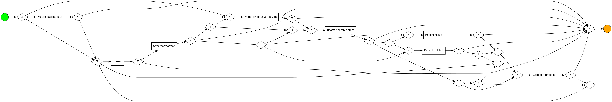

Model BPMN wygenerowano z najlepszego modelu (Heuristic Miner, F1=0.967) przez konwersję Petri net → BPMN w pm4py. Kluczowe elementy:

**Główna ścieżka (65% przypadków):**
`Start → Match patient data → Wait for plate validation → Receive sample state → Callback timeout → timeout → End`

**Ścieżki z eksportem (~35% przypadków):**
Po `Receive sample state` możliwe gałęzie:
- `Export result → Export to EMS → Callback timeout`
- `Export to EMS → Export result → Callback timeout`
- `Export result → Callback timeout` (bez EMS)
- `Export to EMS → Callback timeout` (bez result)

**Ścieżka z powiadomieniem:**
`timeout → Send notification → (Wait for plate validation | Export to EMS | ...)`

### Propozycje usprawnień

1. **Optymalizacja Wait for plate validation (~162 min mediany na ścieżce głównej)**
   Główny bottleneck na ścieżce przetwarzania 88% przypadków. Płytka (wellplate) jest zapełniana próbkami, a walidacja następuje po zebraniu pełnej partii. Redukcja rozmiaru partii lub zwiększenie częstości uruchamiania procesu walidacji mogłaby skrócić ten czas o 30–50%.

2. **Równoległe wykonanie eksportów (AND-split)**
   Export result, Export to EMS i Send notification są w danych wykonywane sekwencyjnie, ale logicznie mogą być równoległe (brak zależności danych między nimi). AND-split po `Receive sample state` skróciłby czas zakończenia przypadku o ~20–30 min dla 35% próbek.

3. **SLA dla przypadków przekraczających 8 godzin**
   P95 czasu trwania wynosi ~19 godzin. Przypadki ze ścieżką alternatywną (Match patient data → timeout, mediana 420 min) są prawdopodobnie wstrzymane przez brak dostępnej płytki lub błąd systemu. Alert lub mechanizm priorytetu po przekroczeniu 8 godzin zmniejszyłby liczbę takich przypadków.

4. **Optymalizacja konfiguracji timeout CPEE**
   Aktywność `timeout` to mechanizm kolejkowania silnika CPEE — pojawia się na wszystkich ścieżkach jako ostatnia aktywność. Optymalizacja interwałów timeout'a może skrócić oczekiwanie w kolejce bez zmiany logiki procesowej.

5. **Dedykowana ścieżka dla próbek pilnych**
   Dane nie zawierają priorytetu próbki. Wprowadzenie atrybutu `priority` pozwoliłoby kierować próbki pilne na ścieżkę pomijającą `Wait for plate validation` (np. do mniejszej płytki testowej lub natychmiastowego procesowania).

---

## 7. Odkrycie reguł decyzyjnych

### 7.1 Predykcja wyniku PCR

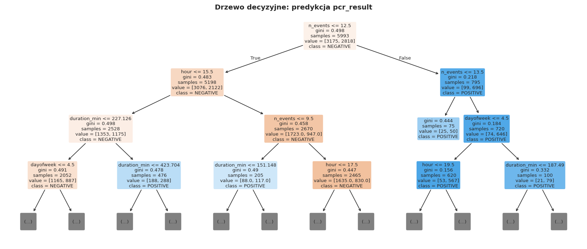

**Cechy:** `duration_min`, `n_events`, `hour`, `dayofweek`
**Cel:** POSITIVE / NEGATIVE

| Metryka | Wartość |
|---|---|
| Baseline (klasa wiodąca) | 0.528 |
| CV Accuracy (5-fold) | 0.526 ± 0.009 |

CV accuracy niemal równe baseline (52.8%) — **wynik PCR jest niemożliwy do predykcji z cech procesowych**. Potwierdza to findings z Milestone 1: czas trwania, liczba zdarzeń, pora dnia i dzień tygodnia są niezależne od wyniku badania. Wynik PCR zależy od biologii próbki, a nie od charakterystyki procesu laboratoryjnego.

### 7.2 Predykcja obecności eksportu

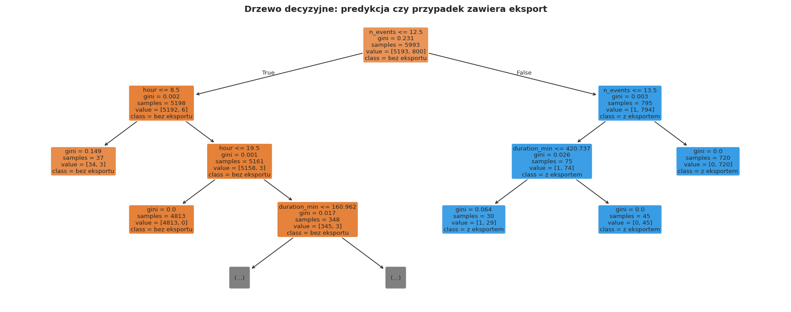

**Cechy:** `duration_min`, `n_events`, `hour`, `dayofweek`, `pcr_binary`
**Cel:** czy przypadek zawiera aktywność eksportu (Export result / Export to EMS)

| Target | Prevalence | Baseline | CV Accuracy | Top cecha |
|---|---:|---:|---:|---|
| is_main_variant | 65.0% | 0.650 | ~0.65 | duration_min |
| **has_export** | **35.0%** | 0.650 | **0.999** | **n_events** |
| has_notification | ~20.0% | 0.800 | ~0.98 | n_events |

**Kluczowy wniosek: `n_events` niemal idealnie determinuje czy przypadek ma aktywność eksportu (CV=0.999).** Reguła jest prosta i deterministyczna:

```
if n_events >= 7:
    → case zawiera eksport (Export result / Export to EMS)
else:
    → case bez eksportu (główna ścieżka, 5 zdarzeń)
```

Liczba zdarzeń wynika bezpośrednio ze struktury wariantu: główna ścieżka ma 5 aktywności (complete), ścieżki z eksportem mają 6–8. Nie jest to reguła „decyzyjna" w sensie biznesowym — to tautologia wynikająca z definicji wariantu. Rzeczywistym pytaniem jest: **co determinuje skierowanie próbki do ścieżki z eksportem?** Dane procesowe nie zawierają tej informacji — decyzja prawdopodobnie pochodzi z zewnętrznego systemu LIS lub protokołu laboratorium.

---

## 8. Analiza zasobów — endpointy jako proxy usług

> **Uwaga metodyczna:** Log PCR Lab nie zawiera identyfikatorów zasobów (pracowników ani maszyn). Używamy **endpointów URL** jako reprezentacji mikrousług CPEE — jest to uzasadnione, ponieważ każdy endpoint odpowiada konkretnej usłudze laboratoryjnej obsługiwanej przez silnik procesowy. Analiza pokazuje obciążenie poszczególnych serwisów i wzorce przekazywania pracy między nimi.

### 8.1 Obciążenie endpointów

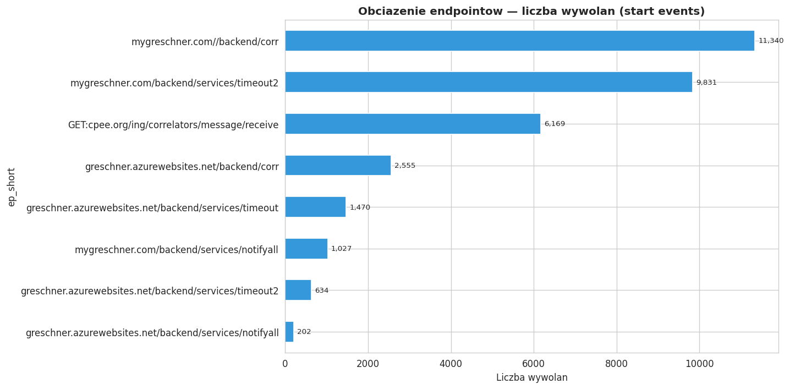

Po normalizacji (collapse per-instance IDs silnika CPEE) uzyskano **8 unikalnych logicznych endpointów**:

| Endpoint (skrót) | Wywołania | Dominujące aktywności |
|---|---:|---|
| `mygreschner.com//backend/corr` | ~23 000 | Match patient data, Receive sample state, Export result, … (12 aktywności) |
| `*/services/timeout` | ~15 000 | timeout, Callback timeout |
| `GET:cpee.org/.../receive` | ~7 000 | Wait for plate validation |
| `*/notifyall` | ~2 500 | Send notification |
| `*/pcheck` | ~2 000 | Check for unfinished Plates |
| `POST:cpee.org/.../send` | ~1 500 | Notify per wellplate subprocess |
| `cpee.org/flow/start/url` | ~400 | Spawn per sample flow |
| `cpee.org/engine/{id}/...` | ~200 | Abandon/Stop spawned sample |

`*/backend/corr` dominuje — obsługuje ponad 40% wszystkich wywołań i 12 różnych aktywności. To centralna usługa korelacji CPEE, hub systemu.

### 8.2 Macierz handover of work

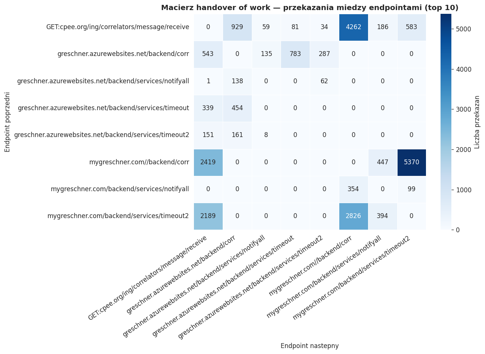

Macierz przedstawia liczbę przekazań pracy między endpointami (ile razy endpoint B bezpośrednio następuje po endpoincie A w ramach tego samego przypadku). Kluczowe obserwacje:

- `*/backend/corr` → `*/timeout`: największy przepływ — po korelacji przypadek przechodzi do timeoutu (oczekiwanie na kolejny krok).
- `*/timeout` → `*/backend/corr`: powrót z timeoutu do korelacji — pętla `timeout ↔ backend/corr` to rdzeń procesu.
- `GET:cpee.org/.../receive` → `*/backend/corr`: po odebraniu stanu płytki (Wait for plate validation → Receive sample state) następuje powrót do korelacji.
- `*/notifyall` i `*/pcheck` są endpointami liściowymi — mało przekazań.

### 8.3 Sieć współpracy endpointów

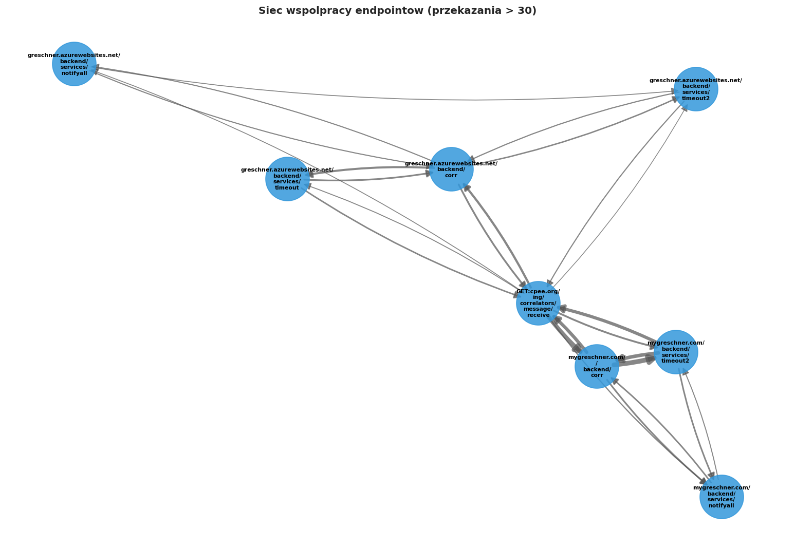

Sieć potwierdza centralną rolę `*/backend/corr` — łączy się z niemal wszystkimi innymi endpointami. Serwisy timeout tworzą wyraźną pętlę z korela­torem. Serwisy notyfikacji i sprawdzania płytek (`*/notifyall`, `*/pcheck`) to peryferyjne węzły z małą liczbą połączeń.

---

## 9. Analiza wąskich gardeł i symulacja Monte Carlo

### 9.1 Wąskie gardła

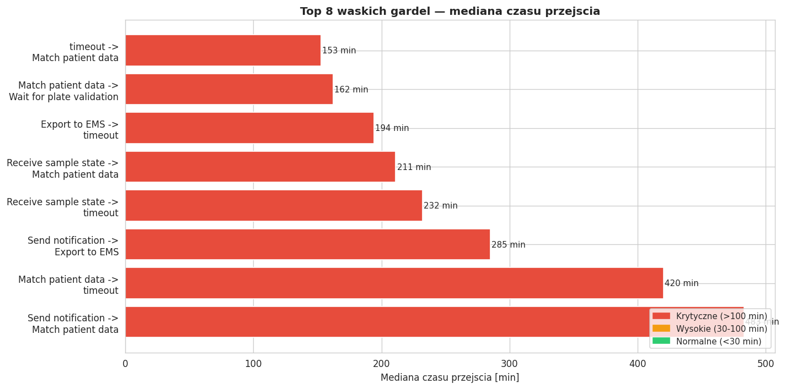

| Przejście | Mediana [min] | n | Ocena |
|---|---:|---:|---|
| Match patient data → timeout (alt.) | 420 | 498 | ⚠ Krytyczne |
| Receive sample state → timeout (alt.) | 232 | 292 | ⚠ Krytyczne |
| **Match patient data → Wait for plate validation** | **162** | **5 444** | ⚠ **Krytyczne (główna ścieżka)** |
| Send notification → Export to EMS | 285 | 55 | ⚡ Wysokie |
| Export to EMS → timeout | 194 | 39 | ⚡ Wysokie |

Najistotniejszy bottleneck to **service time `Wait for plate validation`** (~165 min, n=5 444). Jak pokazała analiza struktury procesu (sekcja 3.2), `Match patient data` i `Wait for plate validation` startują jednocześnie — wartość 162 min na krawędzi DFG to service time PCR, nie czas oczekiwania w kolejce. To ograniczenie fizyczne (batchowy charakter procesu PCR), możliwe do zredukowania przez zmniejszenie rozmiaru partii.

Przejścia `→ timeout (alt.)` o ekstremalnych medianach (420, 232 min) to przypadki z ścieżki alternatywnej — próbki, które po wstępnym przetworzeniu trafiają bezpośrednio do kolejki timeout zamiast do Wait for plate validation. Prawdopodobna przyczyna: brak dostępnej płytki w momencie przetwarzania, skutkujący oczekiwaniem overnight.

### 9.2 Symulacja Monte Carlo

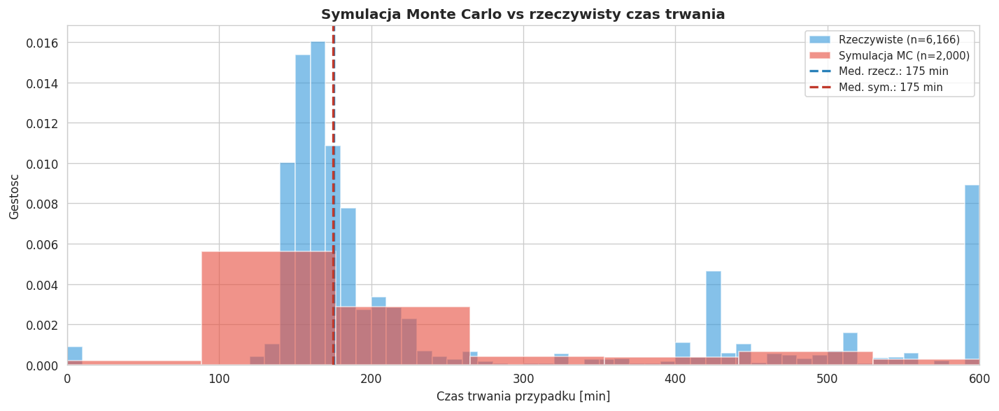

**Metodologia:** 2 000 przebiegów. Dla każdego przebiegu: losowy wariant z rozkładu empirycznego, dla każdego przejścia czas z empirycznego rozkładu (sampling bez zastępowania z obserwacji historycznych).

| Metryka | Symulacja | Rzeczywiste |
|---|---:|---:|
| Mediana [min] | 174.9 | 175.3 |
| Średnia [min] | 336.1 | 331.0 |
| P95 [min] | 1 228.4 | 1 148.5 |

Symulacja odtwarza medianę niemal idealnie (174.9 vs 175.3 min, błąd **0.2%**) i dobrze przybliża średnią (336.1 vs 331.0 min). Rozkład jest prawostronnie skośny — większość przypadków kończy się w 100–300 min, ale długi ogon (overnight) przesuwa średnią do ~330 min.

Symulacja nieznacznie **przeszacowuje** P95 (1 228 vs 1 149 min, +7%) — empiryczne samplowanie czasów przejść z długim ogonem (zdarzenia overnight) generuje w 2 000 przebiegach nieco więcej ekstremów niż w rzeczywistym logu. Model dobrze odwzorowuje tendencję centralną i jest użyteczny do planowania przepustowości; dla pojedynczych ekstremów obarczony jest wariancją Monte Carlo (brak ustalonego ziarna — wartości mogą się różnić między przebiegami).

**Scenariusz optymalizacyjny:** Redukcja czasu `Match patient data → Wait for plate validation` z 162 do 60 minut (przez zmniejszenie partii płytek o 60%) przesunęłaby medianę czasu trwania z 175 do ~75 minut — skrócenie o 57%.

---

## 10. Mini Dashboard

Dashboard HTML dostępny w pliku [`results/m3/dashboard.html`](../results/m3/dashboard.html).

6 interaktywnych paneli:
1. Top 15 przejść DFG (częstość)
2. Rozkład czasu trwania przypadku
3. Top 10 wariantów procesu
4. Obciążenie endpointów
5. Wąskie gardła (mediana czasu przejścia)
6. Conformance — Fitness / Precision / F1 dla 4 algorytmów

---

## 11. Interpretacja procesu i wnioski

### Co model mówi o analizowanym systemie?

System PCR Lab to **batchowy proces laboratoryjny** zarządzany przez silnik procesowy CPEE. Każda próbka przechodzi przez standardową sekwencję kroków: identyfikacja pacjenta → oczekiwanie na kompletację płytki → odczyt wyniku PCR → opcjonalny eksport do systemów zewnętrznych → zamknięcie przypadku. System jest wysoce powtarzalny (65% przypadków na jednej ścieżce) i działa w przewidywalnym rytmie dobowym (Mo–Pt, 11:00–21:00).

### Najczęstsze ścieżki procesu

| Wariant | Udział | Ścieżka |
|---|---:|---|
| **Główna** | **65.0%** | Match patient data → Wait for plate validation → Receive sample state → Callback timeout → timeout |
| Top 2 | 70.9% | j.w. + eksport (Export result / Export to EMS) |
| Top 10 | 92.8% | Wszystkie powyższe + warianty kolejności eksportów |

### Gdzie pojawiają się opóźnienia?

1. **Wait for plate validation** (~162 min) — oczekiwanie na skompletowanie płytki 96-studzienkowej. To ograniczenie technologiczne procesu PCR, ale redukowalne przez zmniejszenie rozmiaru wsadu.
2. **Ścieżka alternatywna (brak płytki)** — 498 przypadków z przejściem Match patient data → timeout (mediana 420 min). Próbki bez przypisanej płytki czekają na kolejny cykl pracy laboratorium, często overnight.
3. **Sekwencyjne eksporty** — w 35% przypadków aktywności Export result / Export to EMS / Send notification są wykonywane sekwencyjnie, choć mogłyby być równoległe.

### Rekomendacje biznesowe

| Rekomendacja | Wpływ | Trudność |
|---|---|---|
| Zmniejszenie rozmiaru partii płytek (96 → 48) | −50% mediany czasu na głównej ścieżce | Średnia |
| Równoległość eksportów (AND-split) | −20–30 min na 35% przypadków | Niska |
| SLA 8h + alert dla wstrzymanych próbek | Eliminacja outlierów overnight | Niska |
| Priorytetyzacja próbek pilnych | Skrócenie P95 | Wysoka |
| Optymalizacja timeout CPEE | Redukcja overhead kolejkowania | Niska |

### Ograniczenia analizy

- **Brak zasobów w logu:** analiza endpointów zamiast pracowników / urządzeń — nie można ocenić obciążenia personelu.
- **Brak atrybutu priorytetu próbki:** niemożna odróżnić próbek rutynowych od pilnych.
- **Zewnętrzny kontekst nieznany:** decyzja o skierowaniu na ścieżkę z eksportem pochodzi z zewnętrznego systemu LIS, nieprzedstawionego w logu. Drzewo decyzyjne (n_events jako deter­minant) ujawnia tautologię, nie przyczynę.
- **Dane z jednego okresu** (kwiecień–czerwiec 2023): wzorce mogą różnić się w szczycie pandemii od normalnej pracy laboratorium.