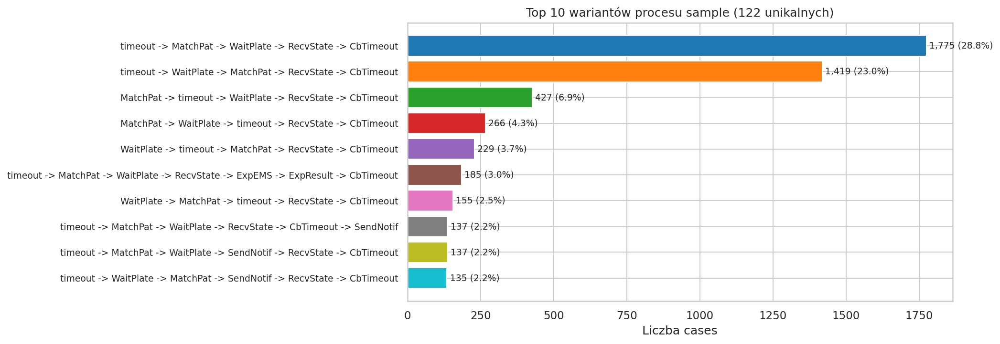
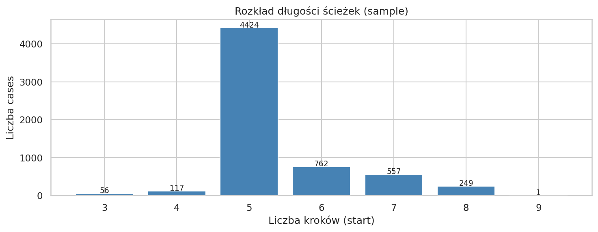
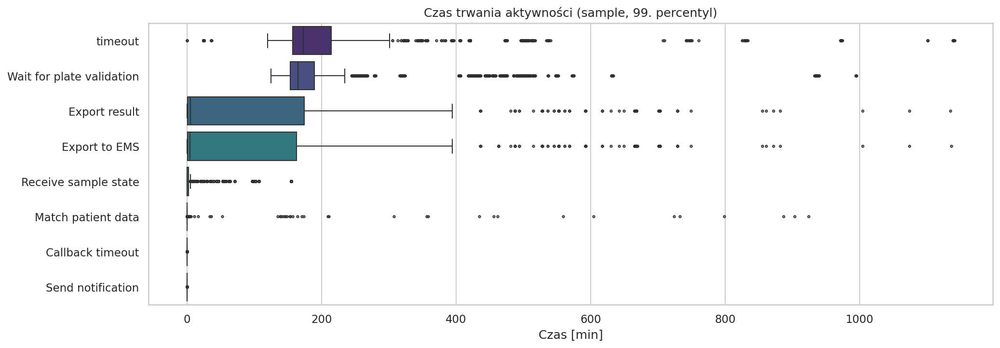
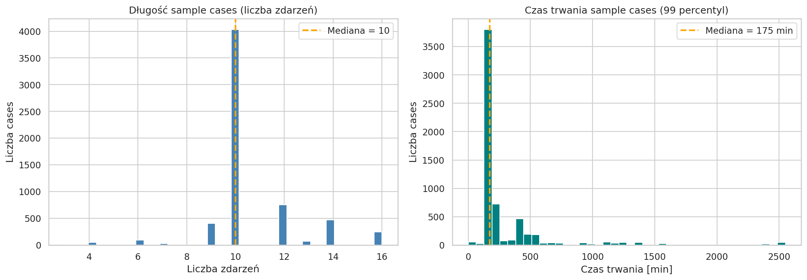
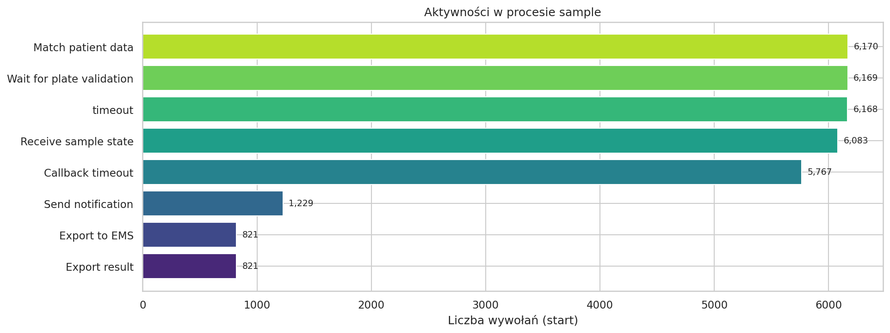
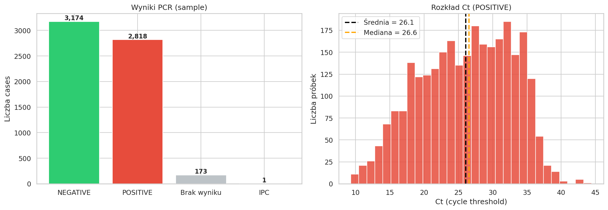
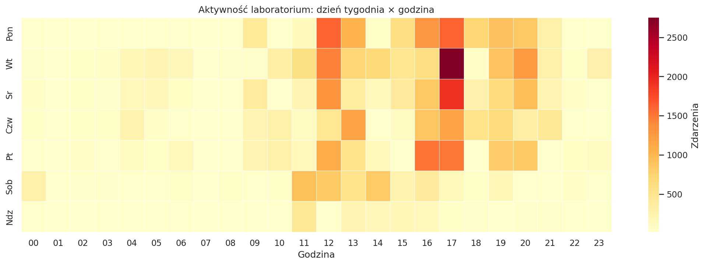
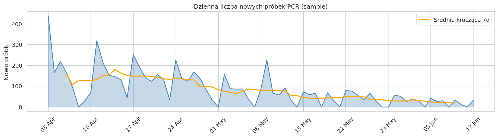
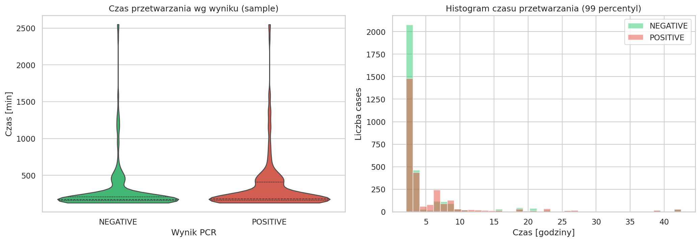
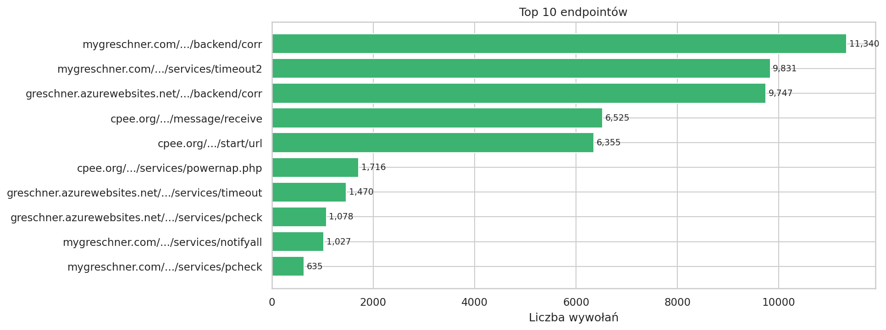

# Milestone 1

- **Autorzy:** Mateusz Świątek, Maciej Mężyk, Patryk Skowron
- **Zbiór:** PCR Lab Data
- **Źródło:** [Zenodo #11617408](https://zenodo.org/records/11617408)
- **Okres:** kwiecień–czerwiec 2023
- **Notebook:** [`notebooks/01_m1_eda.ipynb`](../notebooks/01_m1_eda.ipynb)

---

## 1. Opis zbioru danych i kontekst

Dane pochodzą z systemu CPEE (Cloud Process Execution Engine), który automatyzuje laboratorium PCR. Każda próbka biologiczna przechodzi kilka kroków: rejestracja, dopasowanie danych pacjenta, oczekiwanie na płytkę, odczyt wyniku. System loguje każdy krok z czasem rozpoczęcia i zakończenia.

Jeden przebieg próbki = **case**. Jeden krok = **zdarzenie (event)**.

Surowy log: 6 339 case'ów, 317 905 zdarzeń. Ponad połowa to zdarzenia techniczne systemu. Po filtracji zostaje **134 099 zdarzeń biznesowych**.

### Typy procesów

| Proces | Co to | Ile case'ów | Zdarzeń na case |
|---|---|---:|---|
| **Sample** | Jedna próbka od rejestracji do wyniku | 6 166 | 10–12 |
| **Wellplate** | Zarządzanie jedną płytką (zbieranie próbek, PCR) | 167 | 64 – 31 838 |
| Lab Plain Instance | Cykl pracy laboratorium | 4 | 330 – 7 983 |
| Lab Finish Watcher | Zamykanie płytek | 2 | ~580 |

Dalej analizujemy tylko **Sample** — to właściwy proces diagnostyczny. Wellplate jest pomocniczy (grupuje próbki na płytkę przed PCR).

---

## 2. Atrybuty logu zdarzeń

| Kolumna | Znaczenie | Status |
|---|---|---|
| `instance_uuid` | ID case'a | kompletny |
| `activity` | Nazwa kroku (np. "Match patient data") | 8 unikalnych |
| `timestamp` | Czas zdarzenia (UTC) | kompletny |
| `lifecycle` | `start` / `complete` | kompletny |
| `pcr_result` | Wynik testu: POSITIVE / NEGATIVE | brak dla 5.6% próbek |
| `ct` | Cycle threshold (im niższy, tym więcej wirusa) | tylko POSITIVE |
| `endpoint` | Adres serwisu obsługującego krok | kompletny |

### Czego brakuje

- **Identyfikator osoby/urządzenia.** Kolumna `endpoint` zawiera adresy serwisów (np. `mygreshner.com/.../backend/corr`), ale nie mówi kto ani co fizycznie przetwarza próbkę. Analiza zasobów (resource) odpada.
- **Koszty / priorytety** — brak w logu.

---

## 3. Jakość danych

Kluczowe pola (ID, aktywność, timestamp, lifecycle) nie mają żadnych braków. Jedyny brak: 346 próbek (5.6%) bez wyniku PCR.

Duplikatów brak. Chronologia poprawna, żaden case nie ma zdarzeń w złej kolejności. Typy danych również w porządku.

Większość kroków ma pełne pary start/complete. Jedynie w `Send notification`, `Export to EMS`, `Export result` brakuje ~1–5% startów/completów.

---

## 4. Eksploracyjna analiza danych

### 4.1 Podstawowe statystyki

| Metryka | Wartość |
|---|---|
| Próbki (cases) | 6 166 |
| Zdarzenia biznesowe | 75 263 |
| Unikalne aktywności | 8 |
| Mediana zdarzeń na próbkę | 10 |
| Mediana czasu przetwarzania | ~3 h |

### 4.2 Warianty procesu

W logu jest 122 warianty, ale większość próbek idzie tą samą drogą. Top 2 warianty = 52% próbek, top 10 = 79%.

Główna ścieżka (~65% próbek):

| Krok | Co robi |
|---|---|
| `timeout` | Rejestracja próbki, start odliczania |
| `Match patient data` | Dopasowanie danych pacjenta |
| `Wait for plate validation` | Czekanie aż płytka się zapełni |
| `Receive sample state` | Odebranie wyniku PCR |
| `Callback timeout` | Zamknięcie procesu |

Drugi wariant (23%) to ta sama ścieżka z zamienioną kolejnością `timeout` i `Match patient data`.

### 4.3 Czas trwania kroków

Prawie cały czas próbki to czekanie na płytkę: `Wait for plate validation` (~165 min) i `timeout` (~175 min). Dopasowanie pacjenta, odbiór wyniku, zamknięcie zajmuje sekundy. Eksporty wyników zwykle ~5 min, ale rozrzut jest duży.

### 4.4 Rozkład zdarzeń i czasu na próbkę

Większość próbek ma dokładnie 10 zdarzeń (5 kroków z start + complete). Próbki z >12 mają dodatkowo eksporty/powiadomienia.

Czas: większość ok. 3h, ale widać ogon w prawo. Próbki >17h możliwe, że utknęły na noc (laboratorium wtedy nie pracuje).

### 4.5 Częstość kroków

5 głównych kroków występuje ~6000 razy, czyli raz na próbkę.

### 4.6 Wyniki PCR i Ct

53% NEGATIVE, 47% POSITIVE, 346 bez wyniku. Rozkład Ct dla próbek POSITIVE jest normalny, średnia ~26.

### 4.7 Heatmapa aktywności

Lab pracuje głównie Pon–Pt ok. 11–21, peak Pon–Wt 12–18. Soboty trochę aktywności, niedziele prawie pusto. Poniedziałkowy peak może być nadrabianiem po weekendzie.

### 4.8 Timeline

Początek kwietnia: >200 próbek dziennie. Koniec maja: ~50. Widać spadek i rytm tygodniowy (weekendy). Dane są z wiosny, spadek zapewne pokrywa się z wygaszeniem fali zakażeń.

### 4.9 Wpływ wyniku PCR na czas przetwarzania

Rozkłady czasu dla NEGATIVE i POSITIVE są prawie identyczne. POSITIVE minimalnie dłuższe (mediana ~183 vs ~172 min). Wynik PCR nie wpływa na czas.

### 4.10 Endpointy (serwisy)

Każdy krok ma przypisany endpoint (adres serwisu). Najczęstszy: `mygreshner.com/.../backend/corr` (11k wywołań). Endpointy mówią który serwis obsługuje krok, ale nic o osobach ani urządzeniach.

---

## 5. Wnioski

Dane są czyste — żadnych duplikatów, spójna chronologia, poprawne typy. Braki: 5.6% próbek bez wyniku PCR i brak identyfikatora osoby/urządzenia (resource).

Proces jest prosty — 65% próbek przechodzi identyczną ścieżkę 5 kroków. Reszta wariantów to albo zamieniona kolejność kroków równoległych, albo dodatkowe eksporty. Czas przetwarzania (~3h) to w zasadzie czekanie na płytkę — samo przetwarzanie trwa sekundy. To bottleneck procesu.

Wynik PCR (53% neg, 47% poz) nie wpływa ani na ścieżkę, ani na czas. Lab pracuje Pon–Pt 11–21, z peakiem na początku tygodnia. Liczba próbek spada przez cały okres (>200 → ~50/dzień), co pokrywa się ze spadkiem zakażeń wiosną 2023.
